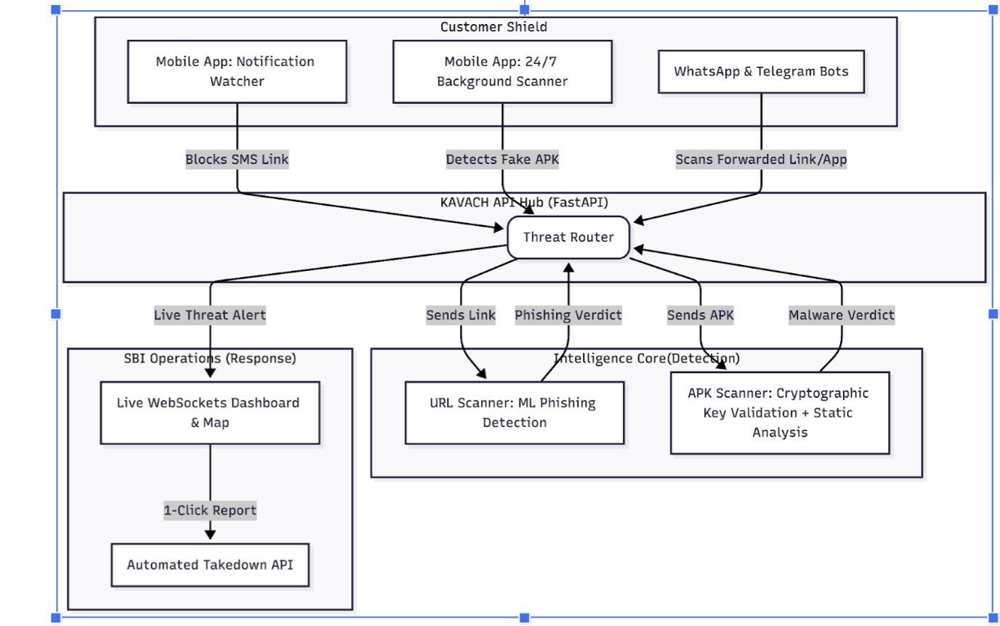

# KAVACH — Fraud Protection Platform

End-to-end stack for detecting **phishing URLs** and **fake banking / impersonation APKs**, with a mobile scanner for customers, a **FraudOps dashboard** for analysts, and a **FastAPI** backend that runs ML models and streams live threats.

Designed to protect banking customers from link fraud and lookalike apps while giving operations a real-time India map view.

## Architecture



| Layer | Components |
|-------|------------|
| **Customer shield** | Notification watcher (SMS links), 24/7 background APK scanner, WhatsApp & Telegram bots |
| **API hub** | FastAPI **Threat Router** — routes scans and live alerts |
| **Intelligence core** | URL scanner (ML phishing), APK scanner (cert validation + static analysis) |
| **Operations** | Live WebSocket dashboard & map, one-click report, automated takedown API |

---

## What’s in the repo

| Component | Stack | Folder | Role |
|-----------|--------|--------|------|
| **Backend API** | Python, FastAPI, Uvicorn | [`backend/`](backend/) | URL/APK scanning, threat store, WebSocket feed, report JSON |
| **FraudOps Dashboard** | React 18, Vite, D3, Leaflet | [`dashboard/`](dashboard/) | Light-themed live map, threat feed, analyst detail panel |
| **KAVACH Mobile App** | Flutter (Android) | [`kavach_app/`](kavach_app/) | Scan URL/APK, location-aware reports, CyberVani education |

---

## Features

### Mobile app (`kavach_app`)
- Manual **URL** and **APK** scanning against the backend
- **GPS + reverse geocoding** (city, state) attached to each scan for map placement
- Verdict UI: phishing, fake APK, review, safe
- Local notifications on high-risk findings
- Android notification listener / package hooks (Kotlin) for background awareness

### Dashboard (`dashboard`)
- **India map** with threat markers (no 3D globe)
- **Live WebSocket** feed — auto-zoom and location HUD on new detections
- Threat detail panel: confidence, URL features, APK cert/behavior, report generation
- Light analyst theme

### Backend (`backend/api`)
- `POST /scan/url` — ML + heuristics on URLs
- `POST /scan/apk` — APK feature model, certificate check, behavior risk
- `GET /threats`, `GET /threats/stats`, `GET /threats/{id}`
- `POST /reports/{id}/all` — CERT-In / Google / Cybercrime-style JSON payloads
- `WS /ws/threats` — broadcast `new_threat` events to dashboards

---

## Project layout

```
.
├── backend/
│   ├── api/                 # FastAPI application
│   ├── url_ml_model/        # URL features + training scripts
│   ├── apk_ml_model/        # APK / Drebin pipeline + scripts
│   └── requirements-api.txt
├── dashboard/               # React FraudOps UI
├── kavach_app/              # Flutter mobile app
└── test_app/                # Optional Flutter test harness
```

Large files (**`.pkl` models**, training **CSVs**, `node_modules`) are **gitignored** — clone the repo, then add artifacts locally (see below).

---

## Prerequisites

- **Python 3.10+** with `pip`
- **Node.js 18+** and `npm`
- **Flutter 3.3+** (for mobile)
- **Android SDK** (emulator or device)
- ML artifacts on disk (after training or copying from your environment)

---

## Quick start

### 1. Backend (port 8000)

```bash
cd backend
python -m venv .venv
source .venv/bin/activate          # Windows: .venv\Scripts\activate
pip install -r requirements-api.txt

# From backend/ — models must exist under url_ml_model/data and apk_ml_model/data
python -m uvicorn api.main:app --host 0.0.0.0 --port 8000 --reload
```

Health check: [http://localhost:8000/health](http://localhost:8000/health)

### 2. Dashboard (port 5173)

```bash
cd dashboard
npm install
npm run dev
```

Open [http://localhost:5173](http://localhost:5173).

Optional env (create `dashboard/.env`):

```env
VITE_API_URL=http://localhost:8000
VITE_WS_URL=ws://localhost:8000/ws/threats
```

### 3. Mobile app

```bash
cd kavach_app
flutter pub get
```

Set the API base URL in [`kavach_app/lib/constants.dart`](kavach_app/lib/constants.dart):

| Target | Typical `backendUrl` |
|--------|----------------------|
| Android emulator | `http://10.0.2.2:8000` |
| Physical phone (same Wi‑Fi) | `http://<your-lan-ip>:8000` |

```bash
flutter run
```

Grant **location** when prompted so scans appear on the dashboard map with city/state labels.

---

## ML models (local setup)

Model weights are **not** stored in Git. After clone, place trained artifacts here:

| Model | Expected paths |
|--------|----------------|
| URL phishing | `backend/url_ml_model/data/url_model.pkl`, `feature_names.pkl` |
| APK malware | `backend/apk_ml_model/data/apk_model.pkl`, `apk_feature_names.pkl` |
| Standalone validators | `backend/apk_ml_model/artifacts/standalone/*.pkl` (optional) |

Train or export using scripts under:

- `backend/url_ml_model/scripts/`
- `backend/apk_ml_model/scripts/`

Run backend tests:

```bash
cd backend
python -m pytest tests/test_kavach_ml_models.py -q
```

---

## API overview

| Method | Path | Description |
|--------|------|-------------|
| `POST` | `/scan/url` | JSON: `url`, `source_channel`, optional `device_city`, `device_state`, `device_lat`, `device_lng`, … |
| `POST` | `/scan/apk` | Multipart `file` + optional device location fields |
| `GET` | `/threats?limit=50` | List recent threats |
| `GET` | `/threats/stats` | Counts by type, verdict, state |
| `GET` | `/threats/{id}` | Single threat |
| `POST` | `/reports/{id}/all` | Generate report bundle |
| `POST` | `/threats/{id}/mark_reported` | Mark reporting flags |
| `WS` | `/ws/threats` | Live `new_threat` events |
| `GET` | `/health` | Service health |

Example URL scan:

```bash
curl -X POST http://localhost:8000/scan/url \
  -H "Content-Type: application/json" \
  -d '{"url":"https://example-phishing-login.fake","source_channel":"manual"}'
```

---

## Configuration

| Variable | Default | Purpose |
|----------|---------|---------|
| `KAVACH_CORS_ORIGINS` | localhost dashboard ports | Comma-separated CORS origins |
| `KAVACH_URL_PHISH_HIGH` | `0.55` | URL phishing threshold |
| `KAVACH_APK_MALWARE_HIGH` | `0.45` | APK malware threshold |

---

## Demo flow

1. Start **backend**, then **dashboard**.
2. Run **KAVACH** on a phone or emulator; allow location.
3. Scan a suspicious URL or sample APK.
4. Watch the dashboard: feed updates, map zooms to the detection, city/state HUD appears.
5. Click a threat → generate reports / mark reported (demo).

